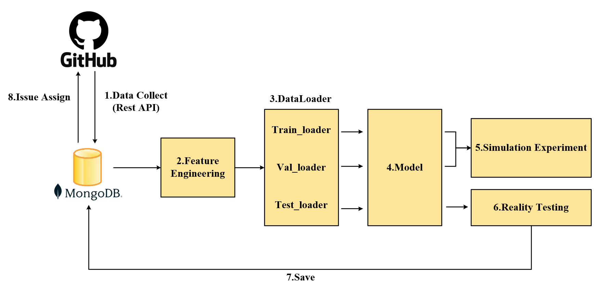

# Issue-Assigner
Issue-Assigner is a comprehensive solution designed to automate the assignment of issues in a repository. It integrates seamlessly with your development workflow to recommend the most suitable developers for resolving specific issues, thereby enhancing efficiency and collaboration.
<div align=center>

</div>
<p align="center">Issue-Assigner Framework</p>

## Features
### 1. Data Acquisition and Updates
- **Real-time Data Acquisition:** Utilize the GitHub REST API to obtain the latest collaboration data within the repository.
- **Continuous Updating:** Support incremental training of the model to adapt to dynamic changes in data, meeting the current application needs of repository maintainers.(feature under development)
### 2. Issue Assignment Task Benchmark
- **Unified Framework:** Implements various models for training and testing under a unified framework using [PyTorch Geometric (PyG)](https://github.com/pyg-team/pytorch_geometric).
- **Module composition:** Includes dataset construction, data loading, and model design tailored for issue assignment tasks.
### 3. Frontend Plugin Functionality
- **Display Recommendations:** Shows recommended developers for the current issue directly within the issue interface.
- **Model Selection:** Allows users to choose from different available models to view various recommendation results.
- **Metric Display:** Show the `Activity` of developers over the **past three months** (weighted exponentially with more recent time having greater weight), average `Community_OpenRank` contribution, and average `Global_OpenRank` influence. This helps repository maintainers make more informed decisions. Refer to the [Opendigger's doc](https://open-digger.cn/en/docs/user_docs/intro) for the meanings of these metrics.
- **Feedback Mechanism:** Users can provide feedback on the recommendations using a thumbs-up (approve) or thumbs-down (disapprove). (This project will not be realized. For details, please refer to [Issue-Assigner-BaaS](https://github.com/zhingoll/Issue-Assigner-BaaS).)
### 4. Backend Service Functionality
- **Result Storage:** Stores the recommended results post-model testing for frontend display.
- **Feedback Storage and Evaluation:** Records real user feedback from the frontend and utilizes the [OpenRank](https://dl.acm.org/doi/10.1145/3639477.3639734) for subsequent model evaluation (feature under development). (This project will not be realized. For details, please refer to [Issue-Assigner-BaaS](https://github.com/zhingoll/Issue-Assigner-BaaS).)

## Project Structure
```plaintext
├── config/             # Model configuration files
├── data/               # Data loading
├── dataset/            # Dataset construction and preprocessing
├── frontend/           # Frontend plugin files
├── model/              # Model implementation, training, and testing
├── server/             # Backend service using FastAPI
├── tools/              # Some toolkits, such as NLP processing and logging tools
├── IssueAssign.py      # IssueAssign class for unified management of models
├── main.py             # Entry point for model training and testing
├── LICENSE             # Open source software license
├── requirements.txt    # Python dependencies
└── README.md           # Project documentation
```

## Installation
### Prerequisites
- **Python:** 3.10.15
- **Torch:** 1.13.1
- **Git:** To clone the repository
- **Node.js and npm:** For frontend development (if you plan to modify the frontend)
- **Browser:** Currently only tested on Edge
- **MongoDB:** 7.0.1
- **Neo4j:** 5.12.0
### Clone the Repository
```bash
git clone https://github.com/zhingoll/Issue-Assigner.git
```
### Install Dependencies
```bash
pip install -r requirements.txt
```

## Usage
### Getting the Specified Repo Data
First, you need to create a `config.yaml` file in the data folder. Examples are as follows:
```bash
mongodb:
  db: "your_db_name"
  url: "your_db_url"
  tz_aware: true
  uuidRepresentation: "standard"

tokens:
  - "your_token1"
  - "your_token2"
  ...

projects:
  - "owner/name" # The repo name you want to get, such as 'X-lab2017/opendigger'
  ...

neo4j:
  uri: "your_uri"
  username: "your_neo4j_name"
  password: "your_password"

repo: # example
  owner: "X-lab2017" 
  name: "open-digger"  # The name(owner/name) of the repo you want to make into a dataset
```
After creating the `config.yaml` file, run:
```bash
python .\data\repo_data_collect.py 
```
This command will get the data of your specified repo and store them in mongodb.
### Building 'Developer-PR-Issue' Collaboration Graph
Run the following command to import the data stored in mongodb in the previous step into neo4j and build a 'Developer-PR-Issue' collaboration graph.
```bash
python .\data\mongo2neo.py
```
### Generating the Raw Materials to Build the Dataset
Run the following command to generate the raw materials needed for model training datasets. 
```bash
python .\data\neo_mongo2csv.py
```
After completion, create a new folder in the `dataset` directory, named after the repository. Then, create a subfolder named `raw` within this new folder. Move the generated CSV file into the `raw` folder, which will be used for building datasets in subsequent model training. For specific operations, refer to the example path provided in the project: `dataset\opendigger\raw\....csv`.
### Running the Main Application
Navigate to the project's root directory and run:
```bash
python main.py
```
This command initiates the training and testing of models related to the issue assignment tasks.
### Obtain Metric Data
Run the following command to retrieve the developer `Activity` in a specified repository over the **past three months**, as well as the `Community_OpenRank` contribution and the `Global_OpenRank` value. The `Activity` is calculated using an **exponentially weighted sum**, giving greater weight to more recent activity. Other metrics are calculated as **averages**.
```bash
python .\server\developer_metrics.py
```
### Using the Frontend Plugin
#### 1.Load the Plugin in the Browser
- Open the Edge browser (currently tested only on Edge).
- Enter developer mode by navigating to `edge://extensions/`.
- Enable the **Developer mode** toggle.
- Click on **Load unpacked** and select the `frontend` folder from the project directory.
#### 2.Start the Backend Service
In a new terminal window, navigate to the server directory:
```bash
cd server
```
Start the FastAPI service using Uvicorn:
```bash
uvicorn server:app --reload
```
#### 3.Interact with the Plugin
As the project is still in the experimental stage, the suggested issue is specified in the file `opened_issues.csv`. The project path example for this file is: `dataset\opendigger\raw\`. You can experience the functionality of the plugin by using the issue number provided in this file. 
- Use the provided interface to **select different models** and view their recommendations.
- Provide **feedback** using the thumbs-up or thumbs-down icons. (This project will not be realized. For details, please refer to [Issue-Assigner-BaaS](https://github.com/zhingoll/Issue-Assigner-BaaS).)

## Future Plans
- Model Expansion: Incorporate additional models and algorithms to improve recommendation accuracy.
- Browser Compatibility: Extend plugin support to other browsers like Chrome and Firefox.
- Simplify the project use process and make it more convenient for users.
- Feedback Integration: Utilize user feedback combined with the OpenRank algorithm for enhanced model evaluation (feature under development).

## Contact
If you have any questions or suggestions, feel free to open an issue~

## License
This project is licensed under the [Apache-2.0 license](LICENSE), please make sure abide by the licenses when using the project.


